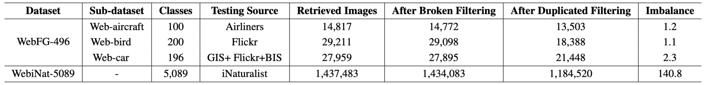
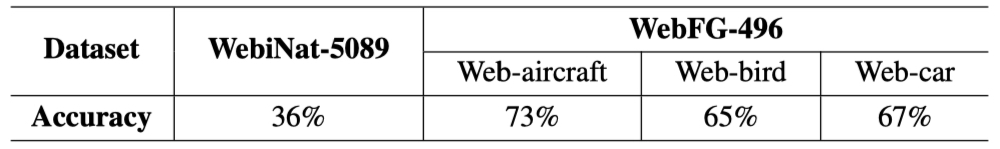

Introduction
------------
Datasets and source code for our paper **Webly Supervised Fine-Grained Recognition: Benchmark Datasets and An Approach**


---

***Datasets: WebFG-496 & WebiNat-5089***
------------
### WebFG-496
WebFG-496 contains 200 subcategories of the "Bird" (Web-bird), 100 subcategories of the  Aircraft" (Web-aircraft), and 196 subcategories of the "Car" (Web-car). It has a total number of 53339 web training images.

Download the dataset:
```
wget https://web-fgvc-496-5089-sh.oss-cn-shanghai.aliyuncs.com/web-aircraft.tar.gz
wget https://web-fgvc-496-5089-sh.oss-cn-shanghai.aliyuncs.com/web-bird.tar.gz
wget https://web-fgvc-496-5089-sh.oss-cn-shanghai.aliyuncs.com/web-car.tar.gz
```


### WebiNat-5089
WebiNat-5089 is a large-scale webly supervised fine-grained dataset, which consists of 5089 subcategories and 1184520 web training images.

Download the dataset from [Baidu Drive](https://pan.baidu.com/s/1oiiulbBkIiAKs5hTtGm2Gw) (code: ubvm)

### Dataset Briefing

1. The statistics of popular fine-grained datasets and our datasets. “Supervision" means the training data is manually labeled (“Manual”) or collected from the web (“Web”).
<div align=center>


</div>

2. Detailed construction process of training data in WebFG-496 and WebiNat-5089. “Testing Source” indicates where testing images come from. “Imbalance” is the number of images in the largest class divided by the number of images in the smallest.
<div align=center>



</div>

3. Rough label accuracy of training data estimated by random sampling for WebFG-496 and WebiNat-5089.
<div align=center>



</div>

---

***Peer-learning model***
--------------------


### Network Architecture

The architecture of our proposed peer-learning model is as follows


### Installation
After creating a virtual environment of python 3.5, run `pip install -r requirements.txt` to install all dependencies

### How to use
The code is currently tested only on GPU
* **Data Preparation**
    - WebFG-496
      
      Download data into PLM root directory and decompress them using
      ```
      tar -xvf web-aircraft.tar.gz
      tar -xvf web-bird.tar.gz
      tar -xvf web-car.tar.gz
      ```
    - WebiNat-5089
      
      Download data into PLM root directory and decompress them using
      ```
      cat web-iNat.tar.gz.part-* | tar -zxv
      ```


* **Source Code**

    - If you want to train the whole network from beginning using source code on the `WebFG-496` dataset, please follow subsequent steps

      - In `Web496_train.sh`
        - Modify `CUDA_VISIBLE_DEVICES` to proper cuda device id.
        - Modify `DATA` to `web-aircraft`/`web-bird`/`web-car` as needed and then modify `N_CLASSES` accordingly.
      - Activate virtual environment(e.g. conda) and then run the script
          ```
          bash Web496_train.sh
          ```

    - If you want to train the whole network from beginning using source code on the `WebiNat-5089` dataset, please follow subsequent steps
      - Modify `CUDA_VISIBLE_DEVICES` to proper cuda device id in `Web5089_train.sh`.
      - Activate virtual environment(e.g. conda) and then run the script
          ```
          bash Web5089_train.sh
          ```


* **Demo**

    - If you just want to do a quick test on the model and check the final fine-grained recognition performance on the `WebFG-496` dataset, please follow subsequent steps

      - Download one of the following trained models into `model/` using
          ```
          wget https://web-fgvc-496-5089-sh.oss-cn-shanghai.aliyuncs.com/Models/plm_web-aircraft_bcnn_best-epoch_74.38.pth
          wget https://web-fgvc-496-5089-sh.oss-cn-shanghai.aliyuncs.com/Models/plm_web-bird_bcnn_best-epoch_76.48.pth
          wget https://web-fgvc-496-5089-sh.oss-cn-shanghai.aliyuncs.com/Models/plm_web-car_bcnn_best-epoch_78.52.pth
          ```
      - Activate virtual environment (e.g. conda)
      - In `Web496_demo.sh`
        - Modify `CUDA_VISIBLE_DEVICES` to proper cuda device id.
        - Modify the model name according to the model downloaded.
        - Modify `DATA` to `web-aircraft`/`web-bird`/`web-car` according to the model downloaded and then modify `N_CLASSES` accordingly.
      - Run demo using `bash Web496_demo.sh`

    - If you just want to do a quick test on the model and check the final fine-grained recognition performance on the `WebiNat-5089` dataset, please follow subsequent steps

      - Download one of the following trained models into `model/` using
          ```
          wget https://web-fgvc-496-5089-sh.oss-cn-shanghai.aliyuncs.com/Models/plm_web-inat_resnet50_best-epoch_54.56.pth
          ```
      - Activate virtual environment (e.g. conda)
      - In `Web5089_demo.sh`
        - Modify `CUDA_VISIBLE_DEVICES` to proper cuda device id.
        - Modify the model name according to the model downloaded.
      - Run demo using `bash Web5089_demo.sh`


---

***Results***
--------------------


1. The comparison of classification accuracy (%) for benchmark methods and webly supervised baselines (Decoupling, Co-teaching, and our Peer-learning) on the WebFG-496 dataset.
<div align=center>


</div>


2. The comparison of classification accuracy (%) of benchmarks and our proposed webly supervised baseline Peer-learning on the WebiNat-5089 dataset.
<div align=center>


</div>


3. The comparisons among our Peer-learning model (PLM), VGG-19, B-CNN, Decoupling (DP), and Co-teaching (CT) on sub-datasets Web-aircraft, Web-bird, and Web-car in WebFG-496 dataset. The value on each sub-dataset is plotted in the dotted line and the average value is plotted in solid line. It should be noted that the classification accuracy is the result of the second stage in the two-step training strategy. Since we have trained 60 epochs in the second stage on the basic network VGG-19, we only compare the first 60 epochs in the second stage of our approach with VGG-19
<div align=center>


</div>


---

Citation
------------

If you find this useful in your research, please consider citing:
```
@inproceedings{
title={Webly Supervised Fine-Grained Recognition: Benchmark Datasets and An Approach},
author={Zeren Sun, Yazhou Yao, Xiu-Shen Wei, Yongshun Zhang, Fumin Shen, Jianxin Wu, Jian Zhang, Heng Tao Shen},
booktitle={IEEE International Conference on Computer Vision (ICCV)},
year={2021}
}
```

